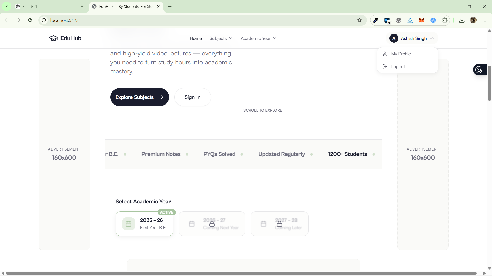
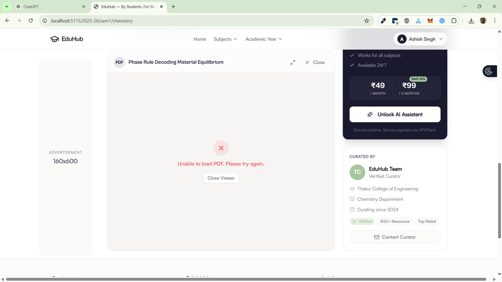

Updates 1:- I want you to update this links in the videos section of the pps subject and this are youtube links, so embed them in the videos section.
PPS:- 
<h3> One shot lecture </h3>
1. C Language Tutorial for Beginners 
embedded code:- <iframe width="560" height="315" src="https://www.youtube.com/embed/irqbmMNs2Bo?si=xObDYwfXv-qJYAhM" title="YouTube video player" frameborder="0" allow="accelerometer; autoplay; clipboard-write; encrypted-media; gyroscope; picture-in-picture; web-share" referrerpolicy="strict-origin-when-cross-origin" allowfullscreen></iframe>

<h3> lectures Playlist </h3>
1. C Programming in One Shot | Part 1 | Variables, Operators and Input/ Output 
embedded code:   <iframe width="560" height="315" src="https://www.youtube.com/embed/rQoqCP7LX60?si=49hF34sVwtOZzDiT" title="YouTube video player" frameborder="0" allow="accelerometer; autoplay; clipboard-write; encrypted-media; gyroscope; picture-in-picture; web-share" referrerpolicy="strict-origin-when-cross-origin" allowfullscreen></iframe>

2. If Else in 1 Video | C Programming | Lecture 2
embedded code:  <iframe width="560" height="315" src="https://www.youtube.com/embed/7PSfRdeY5qE?si=GxEi6mVk7IXlmmyD" title="YouTube video player" frameborder="0" allow="accelerometer; autoplay; clipboard-write; encrypted-media; gyroscope; picture-in-picture; web-share" referrerpolicy="strict-origin-when-cross-origin" allowfullscreen></iframe>

3. Loops in One Shot | C Programming | Lecture 3
embedded code:  <iframe width="560" height="315" src="https://www.youtube.com/embed/wYvrBXUfFfw?si=m8tcHdp84kFd6P8v" title="YouTube video player" frameborder="0" allow="accelerometer; autoplay; clipboard-write; encrypted-media; gyroscope; picture-in-picture; web-share" referrerpolicy="strict-origin-when-cross-origin" allowfullscreen></iframe>

4. Pattern Printing in One Video | Lecture 4
embedded code:  <iframe width="560" height="315" src="https://www.youtube.com/embed/clIcH1ALHMw?si=yxYJFYjF0jEhyzbo" title="YouTube video player" frameborder="0" allow="accelerometer; autoplay; clipboard-write; encrypted-media; gyroscope; picture-in-picture; web-share" referrerpolicy="strict-origin-when-cross-origin" allowfullscreen></iframe>

5. Functions & Pointers in One Shot | C Programming | Lecture 5     
embedded code:  <iframe width="560" height="315" src="https://www.youtube.com/embed/mIY3QVktHU8?si=NgYvi1RiDfohi5f5" title="YouTube video player" frameborder="0" allow="accelerometer; autoplay; clipboard-write; encrypted-media; gyroscope; picture-in-picture; web-share" referrerpolicy="strict-origin-when-cross-origin" allowfullscreen></iframe>

6. Recursion in One Shot | C Programming | Lecture 6 
embedded code:  <iframe width="560" height="315" src="https://www.youtube.com/embed/Bd-1YM8taBc?si=g7EC67VGQ_9A5TE3" title="YouTube video player" frameborder="0" allow="accelerometer; autoplay; clipboard-write; encrypted-media; gyroscope; picture-in-picture; web-share" referrerpolicy="strict-origin-when-cross-origin" allowfullscreen></iframe>

7. Arrays in One Shot | C Programming | Lecture 7
embedded code:  <iframe width="560" height="315" src="https://www.youtube.com/embed/aWKJ5lRgI3U?si=g5GwSArCpLT0uL3T" title="YouTube video player" frameborder="0" allow="accelerometer; autoplay; clipboard-write; encrypted-media; gyroscope; picture-in-picture; web-share" referrerpolicy="strict-origin-when-cross-origin" allowfullscreen></iframe>

8. 2D Arrays in One Shot | C Programming | Lecture 8
embedded code:  <iframe width="560" height="315" src="https://www.youtube.com/embed/sEiMDFdbPGo?si=T_fcSTiWZ2oRX6tF" title="YouTube video player" frameborder="0" allow="accelerometer; autoplay; clipboard-write; encrypted-media; gyroscope; picture-in-picture; web-share" referrerpolicy="strict-origin-when-cross-origin" allowfullscreen></iframe>

9. Strings in One Shot | Lecture 9 
embedded code:  <iframe width="560" height="315" src="https://www.youtube.com/embed/8qKp63Ox3vQ?si=DjofijiW21z9urQI" title="YouTube video player" frameborder="0" allow="accelerometer; autoplay; clipboard-write; encrypted-media; gyroscope; picture-in-picture; web-share" referrerpolicy="strict-origin-when-cross-origin" allowfullscreen></iframe>

10. Structures in One Shot | Lecture 10
embedded code:  <iframe width="560" height="315" src="https://www.youtube.com/embed/nDmULDo8D18?si=ryjaH37LQdJ3mkQM" title="YouTube video player" frameborder="0" allow="accelerometer; autoplay; clipboard-write; encrypted-media; gyroscope; picture-in-picture; web-share" referrerpolicy="strict-origin-when-cross-origin" allowfullscreen></iframe>

11. Sorting | Time and Space Analysis | Lecture 11
embedded code:  <iframe width="560" height="315" src="https://www.youtube.com/embed/9s1_FWWxvlg?si=F1ERpfIZ9ZJHN7ry" title="YouTube video player" frameborder="0" allow="accelerometer; autoplay; clipboard-write; encrypted-media; gyroscope; picture-in-picture; web-share" referrerpolicy="strict-origin-when-cross-origin" allowfullscreen></iframe>

12. File Handling | Preprocessor | Dynamic Memory Allocation | Switch Statement | Lecture 12
embedded code:  <iframe width="560" height="315" src="https://www.youtube.com/embed/4DljBbiC2p4?si=uuxFOn_QuxmDadhF" title="YouTube video player" frameborder="0" allow="accelerometer; autoplay; clipboard-write; encrypted-media; gyroscope; picture-in-picture; web-share" referrerpolicy="strict-origin-when-cross-origin" allowfullscreen></iframe>

 "C:\Users\Ashish\OneDrive\Pictures\Screenshots 1\Screenshot (1494).png"
you see in this image the sign in button is showing even after llogin in my account and also same even after login in then i click on this sign in button and it show me the signin page which is not correct flow after the account is logined it it should disappear.

in this folder of the fe-notes the flow of the subject sem wise in the notes folder is not correct so correct it and make it in the same flow as its on the website hte semwise the folders thats why the iiks notes are not uplaoded on the website yet beacuse the folder is only missing 

 "C:\Users\Ashish\OneDrive\Pictures\Screenshots 1\Screenshot (1495).png"
in this image you see the files are not again opening some issue check it whether its from the database side or any code issues this issue could be also due to the backend is not running thats why so run it once and then ask me to check whether the pdf is opening or not
First do these much changes then we will move to other things and also in
this image [Screenshot(1496)](image-2.png) "C:\Users\Ashish\OneDrive\Pictures\Screenshots 1\Screenshot (1496).png"
in this image you see that the mock data shouldnt be their like this much pdf or this much videos it should match with the amount of files uplaoded their and for rightnow this files should be visible to one emeail id only adn if any other email id is logged in then it should not be visible to them and that email idd which should be their is this [ashishhsingh4444@gmail.com] 